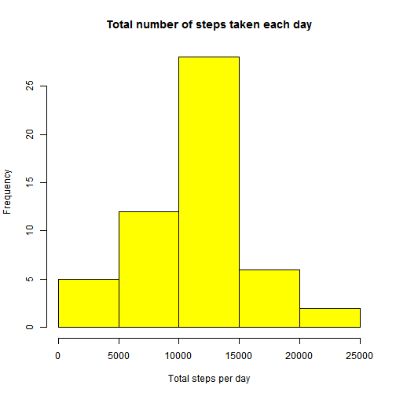
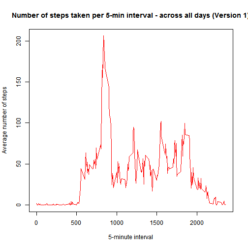
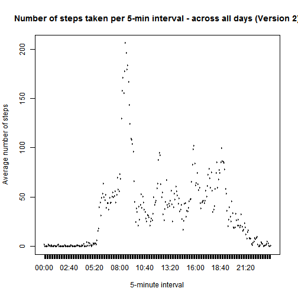
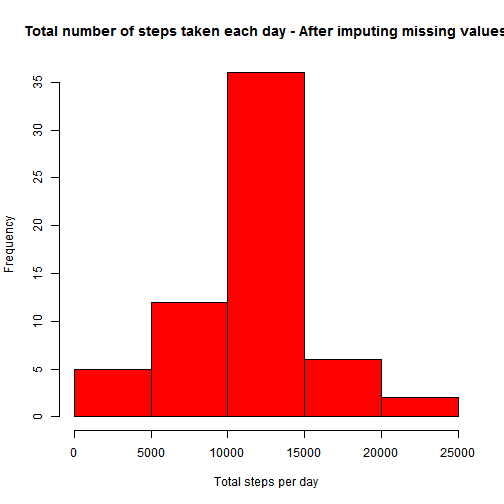
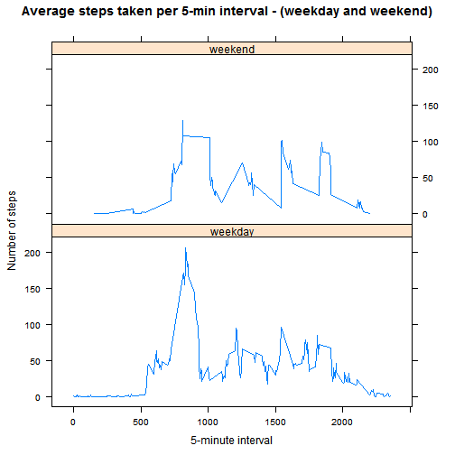

### Loading (reading) the data 


```r
 activity = read.csv(file="activity.csv", header = TRUE, sep = ",")
```

#### Doing some initial exploratory of the data

```r
# See what fields are present in the data set just loaded...
names(activity)
```

```
## [1] "steps"    "date"     "interval"
```

```r
# See some general information about the original data set just loaded...
summary(activity)
```

```
##      steps               date          interval   
##  Min.   :  0.0   2012-10-01:  288   Min.   :   0  
##  1st Qu.:  0.0   2012-10-02:  288   1st Qu.: 589  
##  Median :  0.0   2012-10-03:  288   Median :1178  
##  Mean   : 37.4   2012-10-04:  288   Mean   :1178  
##  3rd Qu.: 12.0   2012-10-05:  288   3rd Qu.:1766  
##  Max.   :806.0   2012-10-06:  288   Max.   :2355  
##  NA's   :2304    (Other)   :15840
```

```r
# See structure of the dataset before applying any transformation to the original data set
str(activity)
```

```
## 'data.frame':	17568 obs. of  3 variables:
##  $ steps   : int  NA NA NA NA NA NA NA NA NA NA ...
##  $ date    : Factor w/ 61 levels "2012-10-01","2012-10-02",..: 1 1 1 1 1 1 1 1 1 1 ...
##  $ interval: int  0 5 10 15 20 25 30 35 40 45 ...
```

##### Add a new variable "interal1"" as a factor to use in the plot...
##### The idea is to show interval in the x-axis as (time) "00:05", "00:10" instead of 0, 5, 10


```r
## Added interval1 as a time factor to show as "00:05", "00:10" in the plot...

activity = transform(activity, date = as.Date(activity$date), 
                     interval1 = format(strptime( (sprintf("%04d", activity$interval)),
                                                  format="%H%M"), format = "%H:%M"))
```


```r
# See structure of the dataset after adding a few variables...
 str(activity)
```

```
## 'data.frame':	17568 obs. of  4 variables:
##  $ steps    : int  NA NA NA NA NA NA NA NA NA NA ...
##  $ date     : Date, format: "2012-10-01" "2012-10-01" ...
##  $ interval : int  0 5 10 15 20 25 30 35 40 45 ...
##  $ interval1: Factor w/ 288 levels "00:00","00:05",..: 1 2 3 4 5 6 7 8 9 10 ...
```


#### Get only complete cases from data set "activity"" and save it in a new dataset "activity.no.na"

```r
no.na.vector = complete.cases(activity)
activity.no.na = activity[no.na.vector==TRUE,]

# Total records with no NAs. 
nrow(activity.no.na)
```

```
## [1] 15264
```

---

### Q1. What is mean total number of steps taken per day? 

####  Calculate total steps per day - Taking out the NAs


```r
total.steps.day.no.na = aggregate(steps ~ date, data = activity.no.na, FUN = sum)

# total.steps.day.no.na
```

---

#### Q1.1. Make a histogram of total number of steps taken per day - Taking out the NAs


```r
hist(total.steps.day.no.na$steps, main="Total number of steps taken each day", xlab="Total steps per day", col="yellow")
```

 

---

#### Q1.2.a Calculate mean total steps per day - Taking out the NAs

```r
mean.total.steps.day = mean(total.steps.day.no.na$steps)

mean.total.steps.day
```

```
## [1] 10766
```

---

#### Q1.2.b  Calculate median total steps per day - Taking out the NAs

```r
median.total.steps.day = median(total.steps.day.no.na$steps)

median.total.steps.day
```

```
## [1] 10765
```

---

### Q2. What is the average daily activity pattern?
##### Q2.1 Make a time series plot... of the 5-minutes and the average number of steps taken across all days...

---

##### Plot for steps pattern - version 1 - showing interval without formatting.

---


```r
# Calculate average steps of 5-minutes interval across all days...
steps.interval.alldays.no.na = aggregate(steps ~ interval, data = activity.no.na, FUN = mean)

# Plot the steps pattern of 5-minutes interval across all days...
plot(steps.interval.alldays.no.na$interval, steps.interval.alldays.no.na$steps, type="l", xlab="5-minute interval", ylab="Average number of steps", main="Number of steps taken per 5-min interval - across all days (Version 1)", col="red")
```

 

---

##### Plot for steps pattern - version 2 - showing interval with reformatting.

---


```r
# Calculate average steps of 5-minutes interval across all days...
steps.interval.alldays.no.na1 = aggregate(steps ~ interval1, data = activity.no.na, FUN = mean)

# Plot the steps pattern of 5-minutes interval across all days...
plot(steps.interval.alldays.no.na1$interval1, steps.interval.alldays.no.na$steps, type="l", xlab="5-minute interval", ylab="Average number of steps", main="Number of steps taken per 5-min interval - across all days (Version 2)", col="red")
```

 


---

##### Explanation of the steps pattern shown in the plot above:
##### a) No walking activity before 5:00 AM, then person starts walking about 6 AM every day.  
##### b) The highest activity is shown between 8:25 to 9 AM with a peak at 8:35 AM and 206 steps
#####   in the 5-minute interval.
##### c) A similar pattern (but with about 100 steps) is shown around Noon, 3:30 PM and from 5 to 6 PM. At noon, maybe the person walks to go for lunch, around 3:30 he takes another break for snack.
##### From 5  to  6 PM the person finishes his day and heads home.
##### d) The activity starts declining as it gets latter at night (time to sleep, which makes sense)

---

##### Q2.2 Which 5-minute interval, on average across all the days in the dataset, contains the maximum number of steps?


##### ==> The 5-minute interval with the maximum stepts is: "08:35" with 206 steps (which is consistent with the plot above)


```r
# Record position with interval containing the max number of steps...
index.max.interval = which(steps.interval.alldays.no.na$steps ==max(steps.interval.alldays.no.na$steps))

# List the interval with the maximum number of steps...
# See that the interval 08:35 contains 206 steps which is consistent with the plot above
steps.interval.alldays.no.na[index.max.interval,]
```

```
##     interval steps
## 104      835 206.2
```

---

### Q3. Imputing missing values

---

##### Q3.1.    Calculate and report the total number of missing values in the dataset (i.e. the total number of rows with NAs)


```r
nas.in.activity = subset(activity, is.na(steps) ==  TRUE)

# Total number of records with NA values in the activity dataset
nrow(nas.in.activity)
```

```
## [1] 2304
```

---

##### Q3.2. Devise a strategy for filling in all of the missing values in the dataset. The strategy does not need to be sophisticated. For example, you could use the mean/median for that day, or the mean for that 5-minute interval, etc.


```r
# --------------------------------------------------------------------------------------
# The strategy used: 
#    Step 1: Merge original dataset (activity) with dataset containing average steps per interval 
#    Step 2: Replace all NAs in column activity$steps with average steps per interval.
# --------------------------------------------------------------------------------------
```


```r
# Step 1: Merge original data set "activity" with data set containing average steps by interval across all days.

# Pending to change back to interval...

merged.activity = merge(activity, steps.interval.alldays.no.na, 
                                                by.x="interval", by.y="interval")
```


```r
# Step 2: Fill NA values with average steps by 5-minute interval
merged.activity$steps.x[is.na(merged.activity$steps.x)==TRUE] = merged.activity$steps.y[is.na(merged.activity$steps.x)==TRUE]
```


```r
# Some clean up...
# Rename steps.x to steps
names(merged.activity)[2] = "steps" 
# Remove column steps.y
merged.activity[5] = NULL
```

---

##### Q3.3.    Create a new dataset that is equal to the original dataset but with the missing data filled in.


```r
# Assign merged.activty dataset to new.activity.dataset with all NAs filled... 
new.activity.dataset = merged.activity
```

---

##### Compare new.activity.dataset with original activity dataset.

---

##### ==> See that the number of observations is 17,568 in both datasets, however, there are no NAs in the new data set...


```r
# New dataset with no NAs...
str(new.activity.dataset)
```

```
## 'data.frame':	17568 obs. of  4 variables:
##  $ interval : int  0 0 0 0 0 0 0 0 0 0 ...
##  $ steps    : num  1.72 0 0 0 0 ...
##  $ date     : Date, format: "2012-10-01" "2012-11-23" ...
##  $ interval1: Factor w/ 288 levels "00:00","00:05",..: 1 1 1 1 1 1 1 1 1 1 ...
```


```r
# Original dataset with NAs...
str(activity)
```

```
## 'data.frame':	17568 obs. of  4 variables:
##  $ steps    : int  NA NA NA NA NA NA NA NA NA NA ...
##  $ date     : Date, format: "2012-10-01" "2012-10-01" ...
##  $ interval : int  0 5 10 15 20 25 30 35 40 45 ...
##  $ interval1: Factor w/ 288 levels "00:00","00:05",..: 1 2 3 4 5 6 7 8 9 10 ...
```


##### Q3.4. Make a histogram of the total number of steps taken each day and Calculate and report the mean and median total number of steps taken per day. Do these values differ from the estimates from the first part of the assignment? What is the impact of imputing missing data on the estimates of the total daily number of steps?


##### Q3.4.a  Histogram of the total number of steps taken each day

```r
# Calcalate total steps taken per day - now with all NAs filled...  
new.total.steps.day = aggregate(steps ~ date, data = new.activity.dataset, FUN = sum)

# Create histogram... 
hist(new.total.steps.day$steps,main="Total number of steps taken each day - After imputing missing values", xlab="Total steps per day", col="red")
```

 

---

##### Note in the histogram above that the mean and median in the new dataset are about the same of the original dataset.  That is the effect of imputing the missing values (in this case replaced the NAs with the average steps per 5-minute interval)

---


##### Q3.4.b Mean total number of steps taken per day  - now with all NAs filled...

```r
# Calculate the new mean...

new.mean.total.steps.day = mean(new.total.steps.day$steps)

# Display the new mean...
new.mean.total.steps.day
```

```
## [1] 10766
```


##### Q3.4.c Median total number of steps taken per day  - now with all NAs filled...

```r
# Calculate the new mean...
new.median.total.steps.day = median(new.total.steps.day$steps)

# Display the new median...
new.median.total.steps.day
```

```
## [1] 10766
```
##### Q3.4.d Do these values differ from the estimates from the first part of the assignment? What is the impact of imputing missing data on the estimates of the total daily number of steps?

---

##### After imputing missing values with the mean, most of the calculation and analysis should look pretty accurate. In this exercise, the median and mean calculated after imputing the missing values look about the same comparing to the original dataset (with NAs). With a slight variance in the median (1 steps), we can conclude that a good strategry for supplying missing values in any dataset analysis would be to use either the mean or the median. Other methods could be considered. See this article for more information: http://en.wikipedia.org/wiki/Imputation_%28statistics%29

---


```r
# Compare mean and median before and after replacing NAs with average steps per interval

mean.media.df = data.frame(Mean=mean.total.steps.day,NewMean=new.mean.total.steps.day,
                           Median=median.total.steps.day,NewMedian=new.median.total.steps.day)
      
mean.media.df
```

```
##    Mean NewMean Median NewMedian
## 1 10766   10766  10765     10766
```


##### See the comparision above for the mean and median from the original dataset (activity) and newMean and NewMedian from the new dataset (new.activity.dataset)

---


### Q4. Are there differences in activity patterns between weekdays and weekends?

##### Q4.1  Create a new factor variable in the dataset with two levels - "weekday" and "weekend" indicating whether a given date is a weekday or weekend day.


```r
# The POSIXlt function is used to return the day # of the week from 0-6 (where Sunday = 0)
# -----------------------------------------------------------------------------------------
new.activity.dataset = transform(new.activity.dataset, 
                       day.type = ifelse((as.POSIXlt(activity$date)$wday >=1 
                                          & as.POSIXlt(activity$date)$wday <=5),
                                         "weekday", "weekend")) 
```


```r
# See dataset with new factor variable: day.type

str(new.activity.dataset)
```

```
## 'data.frame':	17568 obs. of  5 variables:
##  $ interval : int  0 0 0 0 0 0 0 0 0 0 ...
##  $ steps    : num  1.72 0 0 0 0 ...
##  $ date     : Date, format: "2012-10-01" "2012-11-23" ...
##  $ interval1: Factor w/ 288 levels "00:00","00:05",..: 1 1 1 1 1 1 1 1 1 1 ...
##  $ day.type : Factor w/ 2 levels "weekday","weekend": 1 1 1 1 1 1 1 1 1 1 ...
```


##### Q4.2 Make a panel plot containing a time series plot (i.e. type = "l") of the 5-minute interval (x-axis) and the average number of steps taken, averaged across all weekday days or weekend days (y-axis). 


```r
# Load library...
 library("lattice")
 
# Calculate average steps of 5-minutes interval across all days for new dataset...
steps.avg.interval = aggregate(steps ~ interval+day.type, data = new.activity.dataset, FUN = mean)

# Make the panel plot
<<<<<<< HEAD
=======

steps.avg.interval = aggregate(steps ~ interval+day.type, data = new.activity.dataset, FUN = mean)

>>>>>>> 19270ffde98d5ebf0739266cfba1db5d7c829bd5
xyplot(steps ~ interval | day.type,
       data = steps.avg.interval,
       type = "l",
       main = "Average steps taken per 5-min interval - (weekday and weekend)",
       xlab = "5-minute interval",
       ylab = "Number of steps",
       layout = c(1,2,1)
       )
```

 


